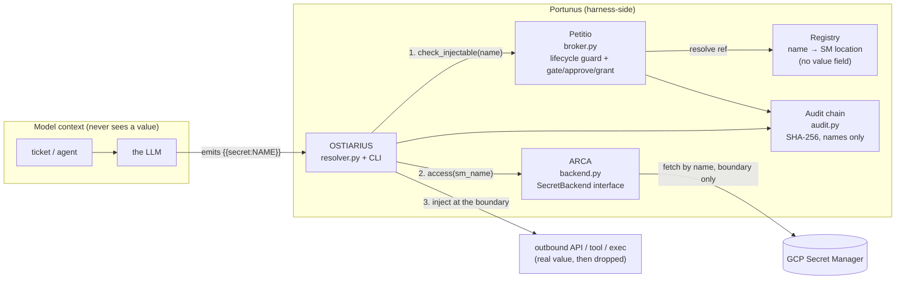

# Portunus

**A harness-side secret broker for the Pantheon god-stack.** Named for the Roman god of keys and gates.

## What & why

An LLM/agent context must **never** contain a plaintext secret. Portunus exists to enforce exactly that
boundary. The model only ever sees a reference — `{{secret:slack-bot-token}}` — and the real value is
fetched and substituted **at the execution boundary** (the outbound API / tool / build call), which runs
*after* the model has produced its output. Secrets are referenced by **name**; the harness injects the
real value only where it is used, then drops it.

It is its own service (not a library baked into one god) so that **every** god shares one audited,
policy-gated secret path — swap the vault backend underneath without any caller changing, and a leak has
exactly one place to be prevented and one place to be audited.

## Component model

**Portunus is the whole secret-broker system**, not any single piece of it. Its components carry their
own (Latin, theme-consistent) names:

| Component | Role | Where it lives |
|---|---|---|
| **OSTIARIUS** | The gatekeeper API — the *only* way to request a value from the vault or deposit one into it (the request/deposit boundary) | `resolver.py` + the `portunus` CLI (`cli.py`) |
| **ARCA** | The vault store itself — the local-encrypted tier (default, Stage 1) and the GCP Secret Manager tier (Stage 2+) behind one interface | `localvault.py` (`LocalEncryptedBackend`, default); `backend.py` (`SecretBackend`, `GcloudBackend`) |
| **Petitio** | The approval-gate wrapper — wraps every OSTIARIUS request so access is always lifecycle-guarded and policy-gated | `broker.py` |
| *(audit)* | Tamper-evident SHA-256 hash-chain access log underneath all of the above | `audit.py` |
| *(registry)* | Reference registry (`name → Secret Manager location`, **never the value**) | `registry.py` |

So: an agent talks to **OSTIARIUS**; **Petitio** decides whether the request may proceed; only then does
**ARCA** give up (or accept) a value — and every decision lands in the audit chain.

## Architecture



The plaintext value flows only into one of three **boundary sinks**: a caller-supplied callable, the argv
of an exec'd subprocess, or a `0600` temp file the caller must delete. It is never returned up the stack,
never written to a log, and never handed back to model-facing code.

## How it fits

Portunus is a **Pantheon runtime plugin** (`type: core`, engine `tool`) — one of the first-class runtime
gods alongside the Anonymizer (PII) and Approval plugins. It runs harness-side, so secrets and PII never
touch LLM chat.

- **Core host** — [pantheon-v2](https://github.com/mdostal/pantheon-v2) owns the plugin contracts; Portunus
  registers its `manifest.json` and exposes the `portunus` tool.
- **Substrate** — orchestrated on [Multica](https://github.com/firefly-events/multica) with the SDLC run
  through [plugin-hive](https://firefly-events.github.io/plugin-hive/).
- **Sibling gods it talks to** — **Janus** (UI layer) mounts the future Vault tab; **Heimdall** holds the
  lane/token *routes* while Portunus controls the token *values*; **Vesta** owns non-secret config so
  Portunus can stay strictly secrets-only.

## Install

```bash
pipx install portunus         # once published
# or, from a clone:
pip install -e ".[test]"
```

Requires Python ≥ 3.9. **The default backend is the local-encrypted ARCA tier** (`LocalEncryptedBackend`,
`cryptography`'s Fernet recipe — AES-128-CBC + HMAC-SHA256; we never hand-roll a cipher). The master key
lives in its own `0600` file, separate from the encrypted vault file, both under `PORTUNUS_HOME` (default
`~/.portunus`, `0700`). Set `PORTUNUS_BACKEND=gcloud` (+ `PORTUNUS_GCP_PROJECT`) to use GCP Secret Manager
instead (Stage 2+); `PORTUNUS_BACKEND=mock` is for tests/dry-runs.

## Quickstart

### Drop a secret into Arca (harness-side only)

`drop` is how a value gets into the local-encrypted vault — from stdin or a local file, **never** an
inline flag (it would land in shell history / `ps`) and never through an LLM turn. It lands in
`state=dropped` (fail-closed) so a separate, explicit `enable` is required before it's injectable:

```bash
portunus drop shared-anthropic dostal-shared-anthropic --value-file /path/to/value   # or --stdin
portunus state shared-anthropic enabled     # now injectable
portunus state shared-anthropic locked      # optional: freeze further changes, still injectable
```

### Register a reference to an out-of-band secret (name → Secret Manager location)

Use this instead of `drop` when the value already lives in the backend (e.g. an existing GCP secret):

```bash
portunus reg add shared-anthropic dostal-shared-anthropic --scope shared --kind anthropic
portunus reg show
```

### Store browser/login session state in Arca

Arca can persist Playwright-style `storageState` or another JSON-serializable session object under a
site/account namespace. The raw vault stores one encrypted blob at `session:<site>:<account>`; inspection
returns only TTL and rotation metadata, never cookies, tokens, or local storage values:

```python
from portunus import LocalEncryptedBackend

vault = LocalEncryptedBackend()
vault.store_session(
    "example.test",
    "dostal@example.test",
    storage_state,
    ttl_seconds=3600,
    rotation_interval_seconds=900,
)
metadata = vault.inspect_session("example.test", "dostal@example.test")
record = vault.load_session("example.test", "dostal@example.test")
```

The registry persists to `$PORTUNUS_HOME/registry.json`. It records the SM name, scope, kind, lifecycle
state, and gate — **never a value**.

### Resolve at the boundary

Exec mode — plaintext exists only in the child process argv, nothing is written to disk:

```bash
portunus resolve --exec curl -H "Authorization: Bearer {{secret:shared-anthropic}}" https://api.anthropic.com/v1/messages
```

Temp-file mode — writes a `0600` file and prints its **path** (never the value); caller reads + deletes:

```bash
path=$(portunus resolve "key={{secret:shared-openai}}")
# ... use "$path" ...
rm -f "$path"
```

Dry-run without GCP — set `PORTUNUS_BACKEND=mock` and provide values via `PORTUNUS_MOCK_<SM_NAME>`.

### 3. Policy: gate / approve / grant

```bash
portunus gate shared-anthropic          # now requires human approval to resolve
portunus approve shared-anthropic --ttl 3
portunus grant shared-anthropic serviceAccount:agent-att@proj.iam   # audited widening
portunus state shared-anthropic revoked  # emergency: blocks all injection
portunus status shared-anthropic
```

### 4. Audit

```bash
portunus audit 25     # last 25 access decisions (names + results, never values)
portunus verify       # prove the hash chain is intact
```

## Library API

```python
from portunus import Registry, AuditChain, Broker, Resolver, GcloudBackend

registry = Registry()
broker   = Broker(registry, AuditChain())
resolver = Resolver(registry, GcloudBackend(project="my-proj"), broker)

# Inject ONLY into the boundary call; the value is never returned to us.
resolver.resolve_call(
    "Authorization: Bearer {{secret:shared-anthropic}}",
    boundary=lambda header: http_post(url, headers={"Authorization": header}),
)
```

## Development

```bash
pip install -e ".[test]"
pytest -q
```

Tests use an in-memory `MockBackend` and an isolated `PORTUNUS_HOME`, so they never touch GCP or real
state. The load-bearing test asserts that a resolved value never appears in a return value, the audit log,
or a non-`0600` file.

## Layout

```
src/portunus/
  registry.py    reference registry (name -> SM path); JSON-backed, no value field
  backend.py     ARCA — SecretBackend protocol; MockBackend (tests) + GcloudBackend (Stage 2+)
  localvault.py  ARCA — LocalEncryptedBackend, the Stage 1 default (encrypted at rest)
  broker.py      Petitio — grant / gate / approve + lifecycle guard, wired to audit
  audit.py       tamper-evident SHA-256 hash-chain access log
  resolver.py    OSTIARIUS — boundary-only {{secret:NAME}} resolution  ← the core
  cli.py         OSTIARIUS — the `portunus` tool (incl. the harness-side `drop`)
  paths.py       shared 0700 state-home resolution
manifest.json    Pantheon plugin manifest (type: core, engine: tool)
```

## Status

**WIP.** The local-first CLI + Python library run today with a passing test suite (23 tests on `main`); the
GCP backend, daemon auto-pull, and Janus Vault tab are the next rungs. See **[VISION.md](./VISION.md)** for
where it is, where it's going, and good first contributions.

## License

MIT © 2026 Mathew Dostal
