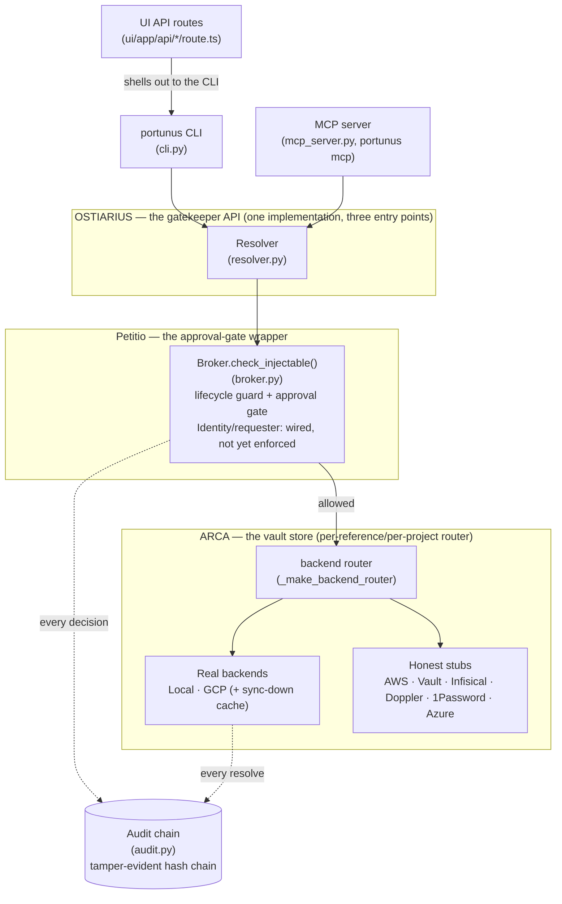
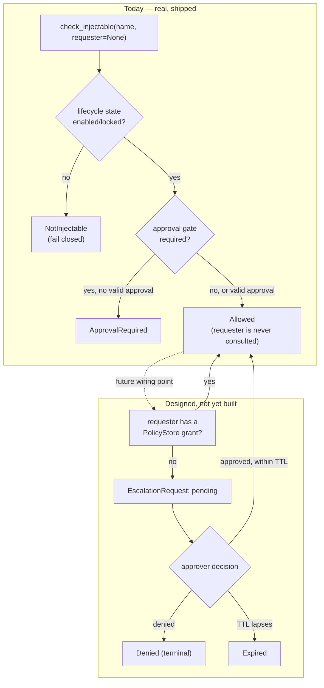
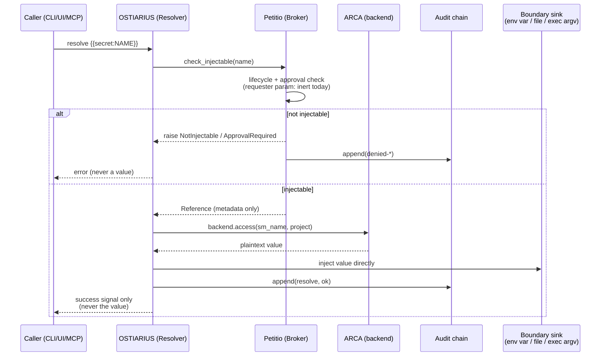
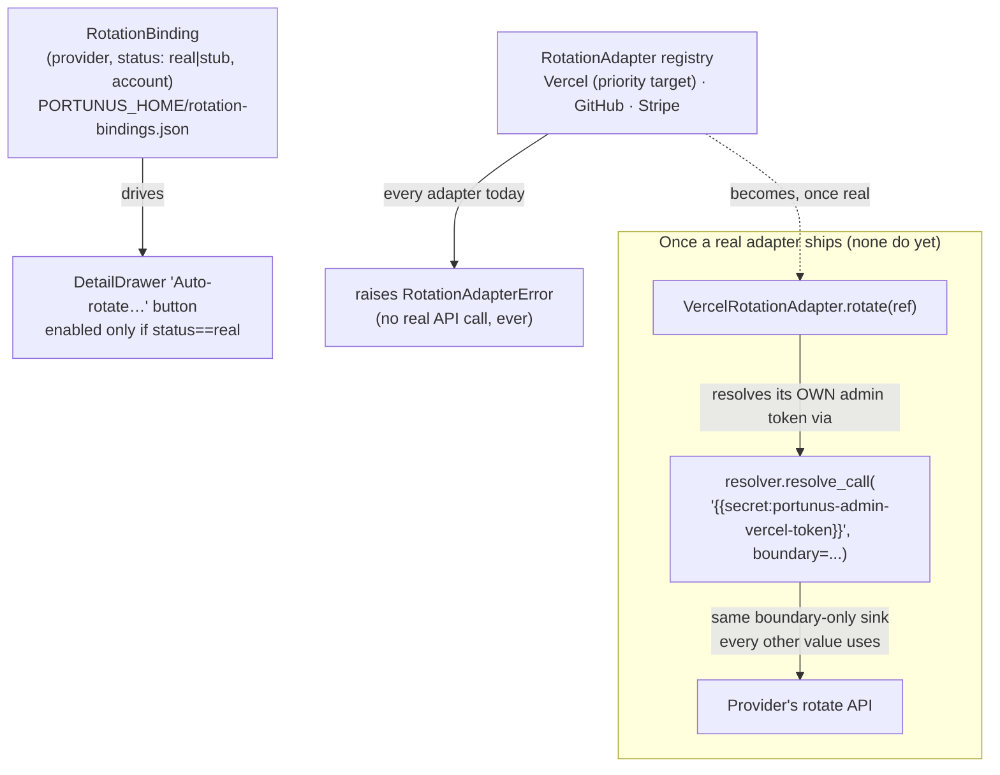

# Portunus Architecture

This is the adopter-facing reference — the one page meant to answer "how does this actually
work" without reading five source files first. For narrative/prose context see the main
[README](../README.md); for the historical design record behind these decisions see
`.pHive/epics/*/docs/`.

## 1. Component diagram

Three OSTIARIUS entry points, one implementation underneath. Every request passes through
Petitio before ARCA ever gives up a value, and every decision — allowed or denied — lands in
the audit chain.

## 2. ARCA backend-selection precedence

A reference resolves through whichever backend actually applies to it — never one global
`PORTUNUS_BACKEND` choice for the whole process. Three levels, checked in order:

`PORTUNUS_BACKEND=mock` always short-circuits this entire tree — every reference resolves
through the single `MockBackend` regardless of any configured binding, a safety rail for tests
and dry runs.

## 3. Petitio: today vs. the designed future

`Identity` and `check_injectable`'s `requester` parameter exist today as a deliberately inert
seam — every caller is currently allowed regardless of who's asking. The state machine below
is the *designed target*, not yet built; no `PolicyStore`/`EscalationRequest` code exists yet.

## 4. Request/resolve sequence

The invariant this diagram exists to make legible: **the approver (today: nobody, since
there's no enforcement yet) never touches the plaintext.** Only the resolver's own boundary
sink (env var, file, or exec argv) ever holds the value, and it's never returned up the stack.

## 5. Rotation provenance

A second, genuinely different kind of "real vs. stub" split from ARCA's own (§2, §1's `Stub`
node): ARCA answers *where a value lives*, `RotationBinding`/`RotationAdapter` (`rotation.py`)
answer *who would rotate it, and whether Portunus can yet*. **Zero real adapters exist today —
every provider is `status="stub"`.** This section documents the shape now so the docs don't
overstate what's built; treat every "would" below as aspirational, not shipped.

The recursive property worth naming explicitly: a real rotation adapter authenticates to its
provider using a credential that is **itself just another Portunus-managed `Reference`** —
resolved through the same `Resolver.resolve_call()` boundary sink every other value in this
codebase already uses, never hardcoded into the adapter and never handled outside the normal
resolve path. Portunus would rotate *other* secrets by using *its own* vaulted admin secret — no
second credential-handling mechanism, ever. This is a design decision recorded ahead of the
build, not a description of running code.

## See also

- [README.md](../README.md) — component model table, install/usage, MCP tool reference
- `.pHive/CONTEXT.md` — terminology glossary
- `.pHive/epics/portunus-swappable-trio/docs/` — the research and design record behind this
  page (6-product vault-adapter research, RBAC/escalation-pattern research, OSS
  adapter-marketplace UX research)
