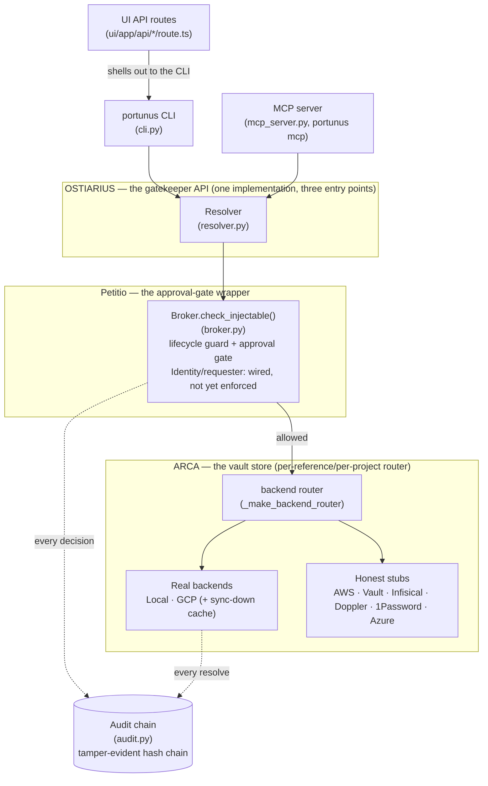
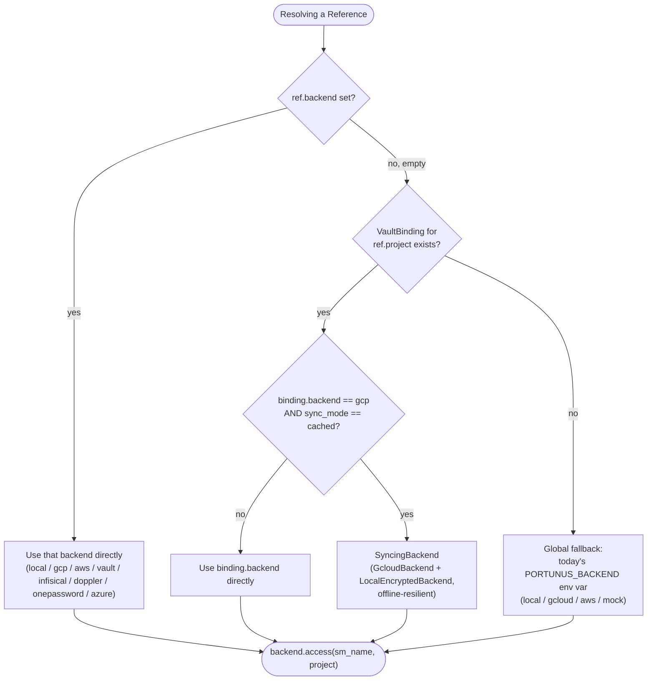
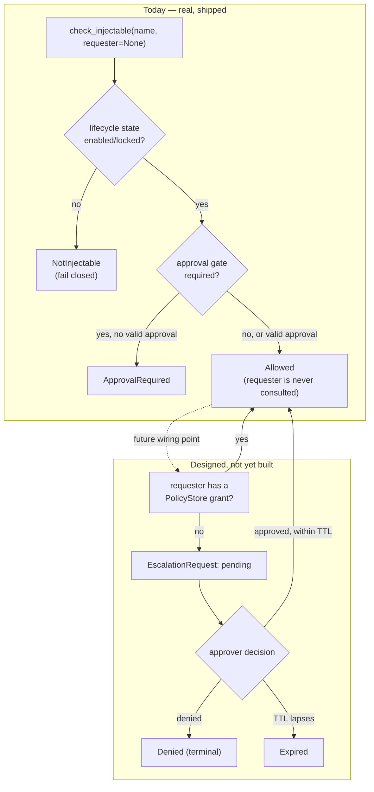
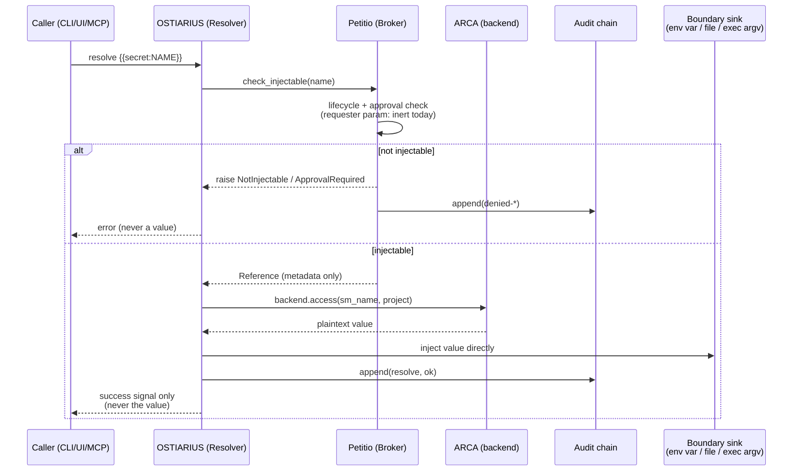
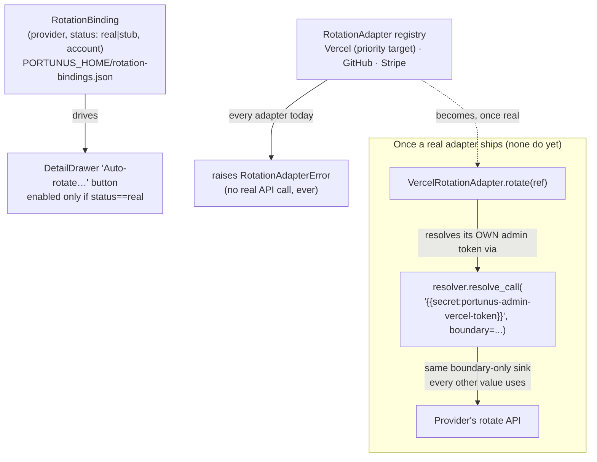

# Portunus Architecture

This is the adopter-facing reference — the one page meant to answer "how does this actually
work" without reading five source files first. For narrative/prose context see the main
[README](../README.md); for the historical design record behind these decisions see
`.pHive/epics/*/docs/`.

## 1. Component diagram

Three OSTIARIUS entry points, one implementation underneath. Every request passes through
Petitio before ARCA ever gives up a value, and every decision — allowed or denied — lands in
the audit chain.

## 2. ARCA backend-selection precedence

A reference resolves through whichever backend actually applies to it — never one global
`PORTUNUS_BACKEND` choice for the whole process. Three levels, checked in order:

`PORTUNUS_BACKEND=mock` always short-circuits this entire tree — every reference resolves
through the single `MockBackend` regardless of any configured binding, a safety rail for tests
and dry runs.

**Configuring this tree from the UI, not just the CLI** (portunus-bindings-settings-ui): the
Standalone UI's Project Explorer edits a `VaultBinding`'s full field set inline —
`backend`/`sync_mode` (already live before this epic) and, as of this epic, `account`/
`wif_audience` too, via `POST /api/bindings`. Both new fields are identity-selector/topology
strings, not credentials, so no new UI trust boundary is introduced — the write path simply
catches up to what `GET /api/bindings` already returned. A `RotationBinding`'s `account` (free-
text rotation context, e.g. a Vercel team slug) is likewise editable inline, in a reference's
detail view next to the Auto-rotate button (`POST /api/rotation-status`, new). Its `status`
(`stub`/`real`) stays derived from the real adapter registry and is structurally unreachable
from the UI — the handler never reads a `status` field off the request body at all, so a UI
control can never make a stub provider look real.

## 3. Petitio: today vs. the designed future

`Identity` and `check_injectable`'s `requester` parameter exist today as a deliberately inert
seam — every caller is currently allowed regardless of who's asking. The state machine below
is the *designed target*, not yet built; no `PolicyStore`/`EscalationRequest` code exists yet.

## 4. Request/resolve sequence

The invariant this diagram exists to make legible: **the approver (today: nobody, since
there's no enforcement yet) never touches the plaintext.** Only the resolver's own boundary
sink (env var, file, or exec argv) ever holds the value, and it's never returned up the stack.

## 5. Rotation provenance

A second, genuinely different kind of "real vs. stub" split from ARCA's own (§2, §1's `Stub`
node): ARCA answers *where a value lives*, `RotationBinding`/`RotationAdapter` (`rotation.py`)
answer *who would rotate it, and whether Portunus can yet*. **Zero real adapters exist today —
every provider is `status="stub"`.** This section documents the shape now so the docs don't
overstate what's built; treat every "would" below as aspirational, not shipped.

The recursive property worth naming explicitly: a real rotation adapter authenticates to its
provider using a credential that is **itself just another Portunus-managed `Reference`** —
resolved through the same `Resolver.resolve_call()` boundary sink every other value in this
codebase already uses, never hardcoded into the adapter and never handled outside the normal
resolve path. Portunus would rotate *other* secrets by using *its own* vaulted admin secret — no
second credential-handling mechanism, ever. This is a design decision recorded ahead of the
build, not a description of running code.

## 6. The desktop app is packaging, not a new component

Worth stating plainly: the Tauri desktop app (`ui/src-tauri/`) is **not** a fifth architecture
component alongside OSTIARIUS/ARCA/Petitio/audit. It's a native wrapper around the existing UI
API-routes entry point (§1's `UIRoutes` node) — a menu-bar presence and a self-update mechanism
around the same Next.js app `npm run dev` already serves, spawned as a sidecar process instead
of run manually. It introduces zero new request paths into OSTIARIUS, zero new backend logic,
and doesn't change how the CLI/MCP surfaces work — cross-project secret access already worked
before this existed, against the one shared `PORTUNUS_HOME`, regardless of which repo an agent
session happens to be rooted in. The one genuinely new piece of logic is the self-update
check, which shells out to the user's own already-authenticated `gh` CLI rather than embedding
a credential in the shipped app — the same "never hold a credential you don't have to"
posture this whole system already enforces everywhere else.

## 7. Provenance metadata: repo/source_files are OSTIARIUS-layer, not a new store

`repo` and `source_files` (`registry.py`) answer *which git repo, and which file in it, actually
consumes a secret* — a real gap found by inspecting the real ffe-cicd data: 342 references, one
shared GCP project spanning many repos, and nothing distinguishing which repo owned which
secret. This is registry metadata, the same layer `group`/`related`/`description` already live
on — it doesn't add a new component, doesn't change ARCA's backend-selection precedence (§2),
and doesn't touch how a value is resolved. `portunus tree --by repo` is the same tree-rendering
path as `--by group` (§1's `Resolver` node is unaffected), keyed on a different field.

## 8. Eager sync-down + vault export/import (portunus-vault-backup)

Two related but mechanically distinct additions on top of §2's ARCA backend-selection tree and
the local-encrypted vault's own file layout, both added to close a real gap: nothing purpose-
built existed for either "get a freshly-discovered secret's value cached locally right away" or
"move/restore the whole vault."

**Eager sync-down.** `discover --register` (CLI and MCP) previously left a freshly-registered
reference's local cache cold — `SyncingBackend` (§2) only pulls a value down on the *first real
resolve*, and a freshly-registered reference always lands at `state=requested`, which
`Broker.check_injectable` fails closed on. For a project bound `sync_mode=cached`, registration
now also calls `_eager_sync_down()` (`cli.py`), which warms the local cache immediately by
calling the routed backend's `access()` directly — deliberately bypassing `check_injectable` for
this one internal, value-never-returned cache-populate call. The reference's `state` stays
`requested` throughout: every real resolve/inject/ask/MCP path is gated exactly as before: only
*when* it's warm changes, never *whether* it's injectable.

**Vault export/import.** `portunus vault export`/`portunus vault import` (CLI-only — no MCP
tool, no UI surface: a full-vault archive should never be triggerable by an LLM-facing tool
without a human directly initiating it) move the vault's critical-state surface as one portable,
passphrase-locked archive. Two pieces make this safe, both in `backup.py`:

- **Coordinated snapshot.** `registry.json`, `master.key`, `vault.enc.json`,
  `vault-bindings.json`, and `audit.log` + `.clock` (the append() sequence counter — MUST travel
  with `audit.log`, not just alongside it, or a restored chain's next `append()` can re-mint a
  seq that already exists) are all read together under every relevant lock — `registry.lock`,
  `vault.enc.lock`, `vault-bindings.lock` (new; previously the only critical-state file with no
  lock at all), `.clock.lock` — acquired in one fixed, alphabetically-sorted order so the result
  reflects one consistent instant, never independent reads straddling a concurrent writer.
  Legacy `gcp-bindings.json`/`rotation-bindings.json` are included if present, read unlocked
  (neither has a dedicated writer-side lock today either).
- **Passphrase re-encryption.** The snapshot is bundled and re-encrypted under a PBKDF2-SHA256-
  derived key (600k iterations) from an operator passphrase — never the vault's own `master.key`
  bundled as-is. `master.key` alone is sufficient to decrypt every stored value; an archive
  meant to leave the access-controlled `PORTUNUS_HOME` must not carry a live decryption key
  un-re-encrypted. The passphrase itself is sourced only via `PORTUNUS_EXPORT_PASSPHRASE` or an
  interactive prompt, never an inline flag — the same boundary-only convention `portunus drop`
  uses for its own sensitive input.

No bidirectional multi-machine sync was built — `SyncingBackend` already solves the narrower
"stay usable while disconnected" problem it exists for, and real sync would need genuine
conflict-resolution design given this vault has real concurrent-writer traffic (see the
`AuditChain`/`LocalEncryptedBackend` lock fixes this epic's own prerequisite work built on).

## 9. `org` hierarchy, sub-vault navigation, and custom views (portunus-vault-trust-and-access)

Planned with a heavier horizontal/vertical process (`.pHive/epics/portunus-vault-trust-and-
access/docs/`) rather than the lighter research-brief-only shape recent epics defaulted to —
the ask (metadata quality, an organizational hierarchy, stubbed RBAC, onboarding) was
genuinely large and interdependent enough to warrant it, the same process
`portunus-standalone-core` used for the original registry/adapter/UI buildout.

**`org`, one level above `project`.** `Reference` gains `org: str = ""` — the same flat-
structured-tag pattern `provider`/`project`/`env`/`repo` already use, added to
`_STRUCTURED_TAG_FIELDS` (so `find --tags org=...` and `retag()`'s collision check both pick it
up immediately) rather than a new nested hierarchy object. `VaultBinding` + `project` already
gave "each vault is its own thing" (per-project backend/credential, already proven for GCP
multi-account); `org` fills the one real missing rung — grouping several projects under one
organizational umbrella (e.g. `firefly-events` spanning `ffe-cicd`/`shindig`).

**Sub-vault navigation is a UI concept, not a new store.** The Standalone UI's Vault Map
renders an org → project drill-down over the `org`/`project` fields — no new backend, no new
API call, no new permission boundary (that's explicitly deferred, stubbed-only future work).
Drilling into a project *feels* like its own small vault (its own list, its own completeness
summary) without duplicating any state.

**Custom views** (`views.py`, `PORTUNUS_HOME/views.json`) are deliberately orthogonal to that
structural hierarchy — a named, human-curated list of reference names for task-shaped
clustering ("everything for the Shindig deploy") that doesn't map onto org/project/env.
Every mutator wraps its own load→mutate→save inside one `flock` acquisition from the start —
unlike `vault-bindings.json`'s own retrofitted save-only lock (§8), this store never had the
race in the first place, proven with a real multi-process concurrent-write test.

**Missing-metadata signal** (`ui/app/completeness.ts`) is a pure, derived-on-render function
over fields the UI already fetches — no new stored field, nothing to drift out of sync with
what it's computed from.

**Explicitly not built here:** any RBAC enforcement. `roles.json` (a future story) will define
a `{scope_type: org|project|env, scope_value, role, actions[]}` policy shape building on
`Identity`/`check_injectable`'s already-inert `requester` seam (§3) — schema and a config
surface only, never wired into `retag()`/`check_injectable`. A visibly greyed-out "coming soon"
treatment in any UI surface that shows it, never a control that looks live but silently does
nothing.

## See also

- [README.md](../README.md) — component model table, install/usage, MCP tool reference
- `.pHive/CONTEXT.md` — terminology glossary
- `.pHive/epics/portunus-swappable-trio/docs/` — the research and design record behind this
  page (6-product vault-adapter research, RBAC/escalation-pattern research, OSS
  adapter-marketplace UX research)
