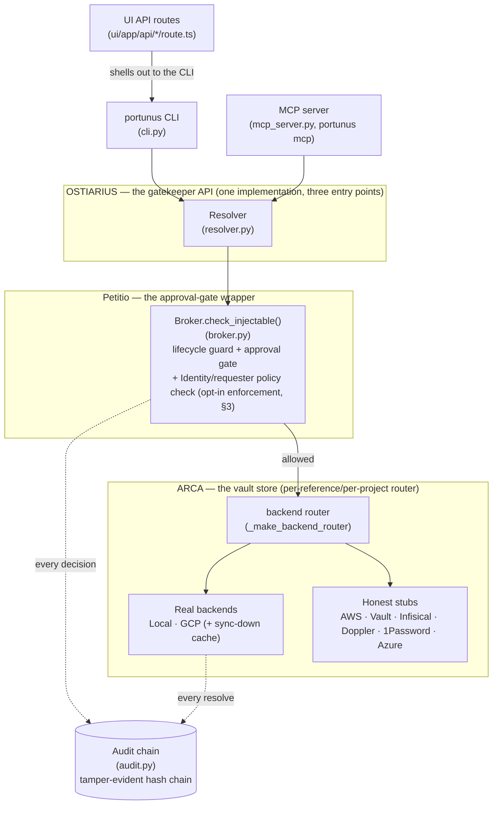
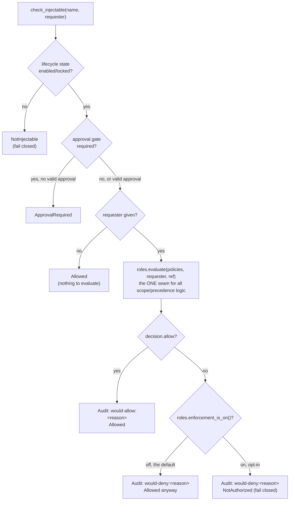
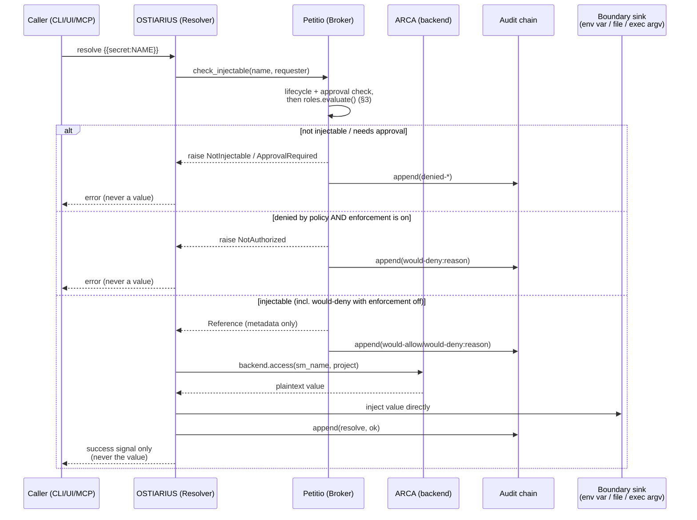
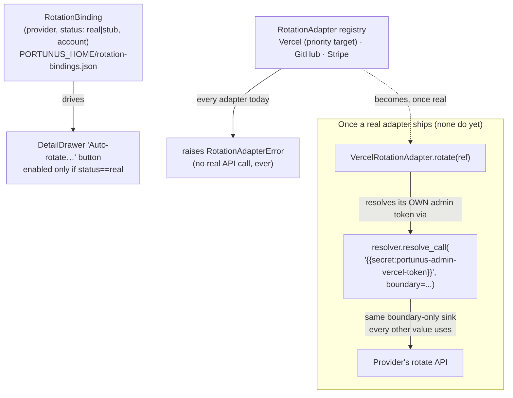

# Portunus Architecture

This is the adopter-facing reference — the one page meant to answer "how does this actually
work" without reading five source files first. For narrative/prose context see the main
[README](../README.md); for the historical design record behind these decisions see
`.pHive/epics/*/docs/`.

## 1. Component diagram

Three OSTIARIUS entry points, one implementation underneath. Every request passes through
Petitio before ARCA ever gives up a value, and every decision — allowed or denied — lands in
the audit chain.

## 2. ARCA backend-selection precedence

A reference resolves through whichever backend actually applies to it — never one global
`PORTUNUS_BACKEND` choice for the whole process. Three levels, checked in order:

`PORTUNUS_BACKEND=mock` always short-circuits this entire tree — every reference resolves
through the single `MockBackend` regardless of any configured binding, a safety rail for tests
and dry runs.

**Configuring this tree from the UI, not just the CLI** (portunus-bindings-settings-ui): the
Standalone UI's Project Explorer edits a `VaultBinding`'s full field set inline —
`backend`/`sync_mode` (already live before this epic) and, as of this epic, `account`/
`wif_audience` too, via `POST /api/bindings`. Both new fields are identity-selector/topology
strings, not credentials, so no new UI trust boundary is introduced — the write path simply
catches up to what `GET /api/bindings` already returned. A `RotationBinding`'s `account` (free-
text rotation context, e.g. a Vercel team slug) is likewise editable inline, in a reference's
detail view next to the Auto-rotate button (`POST /api/rotation-status`, new). Its `status`
(`stub`/`real`) stays derived from the real adapter registry and is structurally unreachable
from the UI — the handler never reads a `status` field off the request body at all, so a UI
control can never make a stub provider look real.

## 3. Petitio: real, opt-in per-agent access control (portunus-petitio-rbac)

`Identity`/`requester` are no longer inert. Every `check_injectable()` call with a real
`requester` gets evaluated against `roles.py`'s `PolicyRecord` store via `roles.evaluate()` --
every resolve gets a `would-allow`/`would-deny` audit line regardless of enforcement state, but
that decision only actually *raises* `NotAuthorized` when `portunus roles enforce on` has been
explicitly run for that vault. Default: off. Even with enforcement globally on, a scope with
zero configured policies always stays fully open -- enforcement only ever narrows behavior for
a scope that has at least one policy record, for a principal not named there.

**Precedence today, a deliberate v1 choice:** a flat OR across every matching `PolicyRecord` --
any one matching, allowing policy is sufficient (no most-specific-wins narrowing yet). This is
intentionally the only place matching/precedence logic lives: `check_injectable()` and every
CLI/MCP caller only ever call `roles.evaluate()` and act on its `Decision`, never reimplement
matching themselves -- so a future precedence model (most-specific-wins, or adopting an engine
like Casbin, the documented fallback from this epic's research) is a change to that one
function's internals, not a rewrite across every call site.

**What's still not scope-aware, by explicit, named decision (not oversight):** the `list`/
`tree` MCP tools return full-vault metadata regardless of the caller's own access scope --
only the actual `resolve`/inject path is gated. `Broker.approve()`'s token is scoped to a
reference name only, not the requesting identity, so a different concurrently-running agent can
walk through the same approval window. Both are real findings from this epic's own research and
self-grill, deliberately deferred rather than silently missed -- see README's Roadmap.

**Threat model, in one sentence:** this defends against honest mistakes and prompt-injected
instructions (an agent resolving something outside its actual task), not a genuinely
adversarial co-resident process -- a self-reported `DOSTAL_AGENT` identity can't defeat that,
and `--home` (full vault isolation) is the correct tool for a known-untrusted caller instead.

## 4. Request/resolve sequence

The invariant this diagram exists to make legible: **the value never flows through Petitio at
all** -- `check_injectable()` (lifecycle + approval + policy evaluation, §3) returns metadata
only, and only the resolver's own boundary sink (env var, file, or exec argv) ever holds the
plaintext. It's never returned up the stack, including through the access-control decision
itself.

## 5. Rotation provenance

A second, genuinely different kind of "real vs. stub" split from ARCA's own (§2, §1's `Stub`
node): ARCA answers *where a value lives*, `RotationBinding`/`RotationAdapter` (`rotation.py`)
answer *who would rotate it, and whether Portunus can yet*. **Zero real adapters exist today —
every provider is `status="stub"`.** This section documents the shape now so the docs don't
overstate what's built; treat every "would" below as aspirational, not shipped.

The recursive property worth naming explicitly: a real rotation adapter authenticates to its
provider using a credential that is **itself just another Portunus-managed `Reference`** —
resolved through the same `Resolver.resolve_call()` boundary sink every other value in this
codebase already uses, never hardcoded into the adapter and never handled outside the normal
resolve path. Portunus would rotate *other* secrets by using *its own* vaulted admin secret — no
second credential-handling mechanism, ever. This is a design decision recorded ahead of the
build, not a description of running code.

## 6. The desktop app is packaging, not a new component

Worth stating plainly: the Tauri desktop app (`ui/src-tauri/`) is **not** a fifth architecture
component alongside OSTIARIUS/ARCA/Petitio/audit. It's a native wrapper around the existing UI
API-routes entry point (§1's `UIRoutes` node) — a menu-bar presence and a self-update mechanism
around the same Next.js app `npm run dev` already serves, spawned as a sidecar process instead
of run manually. It introduces zero new request paths into OSTIARIUS, zero new backend logic,
and doesn't change how the CLI/MCP surfaces work — cross-project secret access already worked
before this existed, against the one shared `PORTUNUS_HOME`, regardless of which repo an agent
session happens to be rooted in. The one genuinely new piece of logic is the self-update
check, which shells out to the user's own already-authenticated `gh` CLI rather than embedding
a credential in the shipped app — the same "never hold a credential you don't have to"
posture this whole system already enforces everywhere else.

## 7. Provenance metadata: repo/source_files are OSTIARIUS-layer, not a new store

`repo` and `source_files` (`registry.py`) answer *which git repo, and which file in it, actually
consumes a secret* — a real gap found by inspecting the real demo-cicd data: 342 references, one
shared GCP project spanning many repos, and nothing distinguishing which repo owned which
secret. This is registry metadata, the same layer `group`/`related`/`description` already live
on — it doesn't add a new component, doesn't change ARCA's backend-selection precedence (§2),
and doesn't touch how a value is resolved. `portunus tree --by repo` is the same tree-rendering
path as `--by group` (§1's `Resolver` node is unaffected), keyed on a different field.

## 8. Eager sync-down + vault export/import (portunus-vault-backup)

Two related but mechanically distinct additions on top of §2's ARCA backend-selection tree and
the local-encrypted vault's own file layout, both added to close a real gap: nothing purpose-
built existed for either "get a freshly-discovered secret's value cached locally right away" or
"move/restore the whole vault."

**Eager sync-down.** `discover --register` (CLI and MCP) previously left a freshly-registered
reference's local cache cold — `SyncingBackend` (§2) only pulls a value down on the *first real
resolve*, and a freshly-registered reference always lands at `state=requested`, which
`Broker.check_injectable` fails closed on. For a project bound `sync_mode=cached`, registration
now also calls `_eager_sync_down()` (`cli.py`), which warms the local cache immediately by
calling the routed backend's `access()` directly — deliberately bypassing `check_injectable` for
this one internal, value-never-returned cache-populate call. The reference's `state` stays
`requested` throughout: every real resolve/inject/ask/MCP path is gated exactly as before: only
*when* it's warm changes, never *whether* it's injectable.

**Vault export/import.** `portunus vault export`/`portunus vault import` (CLI-only — no MCP
tool, no UI surface: a full-vault archive should never be triggerable by an LLM-facing tool
without a human directly initiating it) move the vault's critical-state surface as one portable,
passphrase-locked archive. Two pieces make this safe, both in `backup.py`:

- **Coordinated snapshot.** `registry.json`, `master.key`, `vault.enc.json`,
  `vault-bindings.json`, and `audit.log` + `.clock` (the append() sequence counter — MUST travel
  with `audit.log`, not just alongside it, or a restored chain's next `append()` can re-mint a
  seq that already exists) are all read together under every relevant lock — `registry.lock`,
  `vault.enc.lock`, `vault-bindings.lock` (new; previously the only critical-state file with no
  lock at all), `.clock.lock` — acquired in one fixed, alphabetically-sorted order so the result
  reflects one consistent instant, never independent reads straddling a concurrent writer.
  Legacy `gcp-bindings.json`/`rotation-bindings.json` are included if present, read unlocked
  (neither has a dedicated writer-side lock today either).
- **Passphrase re-encryption.** The snapshot is bundled and re-encrypted under a PBKDF2-SHA256-
  derived key (600k iterations) from an operator passphrase — never the vault's own `master.key`
  bundled as-is. `master.key` alone is sufficient to decrypt every stored value; an archive
  meant to leave the access-controlled `PORTUNUS_HOME` must not carry a live decryption key
  un-re-encrypted. The passphrase itself is sourced only via `PORTUNUS_EXPORT_PASSPHRASE` or an
  interactive prompt, never an inline flag — the same boundary-only convention `portunus drop`
  uses for its own sensitive input.

No bidirectional multi-machine sync was built — `SyncingBackend` already solves the narrower
"stay usable while disconnected" problem it exists for, and real sync would need genuine
conflict-resolution design given this vault has real concurrent-writer traffic (see the
`AuditChain`/`LocalEncryptedBackend` lock fixes this epic's own prerequisite work built on).

## 9. `org` hierarchy, sub-vault navigation, and custom views (portunus-vault-trust-and-access)

Planned with a heavier horizontal/vertical process (`.pHive/epics/portunus-vault-trust-and-
access/docs/`) rather than the lighter research-brief-only shape recent epics defaulted to —
the ask (metadata quality, an organizational hierarchy, stubbed RBAC, onboarding) was
genuinely large and interdependent enough to warrant it, the same process
`portunus-standalone-core` used for the original registry/adapter/UI buildout.

**`org`, one level above `project`.** `Reference` gains `org: str = ""` — the same flat-
structured-tag pattern `provider`/`project`/`env`/`repo` already use, added to
`_STRUCTURED_TAG_FIELDS` (so `find --tags org=...` and `retag()`'s collision check both pick it
up immediately) rather than a new nested hierarchy object. `VaultBinding` + `project` already
gave "each vault is its own thing" (per-project backend/credential, already proven for GCP
multi-account); `org` fills the one real missing rung — grouping several projects under one
organizational umbrella (e.g. `firefly-events` spanning `demo-cicd`/`shindig`).

**Sub-vault navigation is a UI concept, not a new store.** The Standalone UI's Vault Map
renders an org → project drill-down over the `org`/`project` fields — no new backend, no new
API call, no new permission boundary (that's explicitly deferred, stubbed-only future work).
Drilling into a project *feels* like its own small vault (its own list, its own completeness
summary) without duplicating any state.

**Custom views** (`views.py`, `PORTUNUS_HOME/views.json`) are deliberately orthogonal to that
structural hierarchy — a named, human-curated list of reference names for task-shaped
clustering ("everything for the Shindig deploy") that doesn't map onto org/project/env.
Every mutator wraps its own load→mutate→save inside one `flock` acquisition from the start —
unlike `vault-bindings.json`'s own retrofitted save-only lock (§8), this store never had the
race in the first place, proven with a real multi-process concurrent-write test.

**Missing-metadata signal** (`ui/app/completeness.ts`) is a pure, derived-on-render function
over fields the UI already fetches — no new stored field, nothing to drift out of sync with
what it's computed from.

**Role/policy schema — shipped here as a deliberate stub, since activated (§3).** At the time
this epic shipped, `roles.py` persisted `PolicyRecord(scope_type: org|project|env, scope_value,
role, actions[])` to `PORTUNUS_HOME/roles.json` for real — `portunus roles set/delete/show` and
the Settings page both genuinely read and wrote it — but `check_injectable()`/`retag()` never
consumed it. `tests/test_roles.py::test_check_injectable_and_retag_are_byte_identical_with_or_
without_roles_configured` was the defining test proving that: byte-identical behavior with or
without policies configured, not just "defaults to permissive" (a materially weaker guarantee a
future edit could silently erode) — and it still passes today, unmodified, extended rather than
broken by the epic that activated this seam. **portunus-petitio-rbac (§3, §17) built directly on
this exact stub**: `PolicyRecord` gained `principal` + a `repo` scope type, `roles.evaluate()`
became the real evaluation function this section once flagged as unresolved (flat-OR precedence,
a deliberate v1 choice — see §3), and `portunus roles enforce on` is the real, opt-in activation.

**LLM-suggests, human-confirms metadata.** `Reference.suggested` is a sidecar dict
(`{field_name: {value, by, at}}`), written only by `Registry.suggest_metadata()` (and the MCP
tool of the same name) — restricted to `SUGGESTIBLE_FIELDS` (`description`/`purpose`/`tags`/
`group`). Routing fields are structurally rejected: `suggest_metadata()` raises rather than
silently ignoring them, so a caller never mistakes "was rejected" for "was suggested but not
shown yet." Confirming a suggestion is NOT a new mutation path — it's the existing `retag()`
applying the suggested value, then `clear_suggestion()` drops the sidecar entry; rejecting is
just `clear_suggestion()` with the live field never touched. This keeps `retag()` as the ONLY
code path that ever writes the four suggestible fields, whether a human typed the value or
confirmed an agent's proposal.

**Settings, the setup wizard, and About are UI-only additions** with no new backend concepts
beyond what's already described above: Settings surfaces the org/project hierarchy (read-only
summary) and roles.json (genuinely editable; the enforcement state itself is a separate,
explicit `portunus roles enforce on|off|status` toggle, §3/§17 -- Settings never implies a
policy is enforced just because it's configured);
`SetupWizard` is a first-run-only flow (`portunus vault status` detects an uninitialized
`PORTUNUS_HOME` — absence of BOTH `registry.json` and `vault-bindings.json`) that walks through
backend choice and an in-UI trigger for `gcloud auth login` (the real, unmodified gcloud OAuth
flow — the wizard doesn't reimplement or intercept it, just gives it a button); its own Roles
step is literally disabled (`<fieldset disabled>`), a deliberately different treatment from
Settings' editable-but-labeled stub, since a first-run flow isn't the place to risk someone
getting lost configuring permissions before they have a vault at all.

## 10. Metadata crawl + deploy-docs report (portunus-metadata-crawl)

Follow-on to §9's suggest/confirm workflow — the "bulk-suggest" work that epic's own
design-discussion.md explicitly deferred. Two independent, read-only tools, neither of which
calls an LLM or writes a `Reference` field itself.

**`crawl_candidates()` (`src/portunus/crawl.py`) is a discovery bundler, not a writer.** For
every reference missing description/purpose/org, it bundles everything already known —
`sm_name`, `group`, `project`, `org`, `repo`, `source_files`, its project's `VaultBinding`, its
provider's `RotationBinding` — into one JSON object, for an LLM (Claude Code, another
MCP-connected agent, or a human) to read and act on via the already-shipped
`Registry.suggest_metadata()`/`portunus_suggest_metadata` (§9). Portunus has zero LLM-API-key
infrastructure anywhere, deliberately — this design bundles context for an *external* caller
rather than inventing one. Real vault data checked during planning (393 references) showed
`repo` set on fewer than 1% of references — a repo-cloning crawler would have almost nothing
to scan — while `sm_name` (often the literal env var name) and `group` (91% filled) are the
strongest signals actually available today; real external-repo scanning stays out of scope
until repo fill-rate rises. Exposed as `portunus crawl [--org] [--project] [--json]` and the
`portunus_crawl_candidates` MCP tool.

**`generate_report()` renders current vault state as Markdown** — an org → project structure,
each reference's known metadata, and an explicit `## Gaps` section — independent of whether
`crawl_candidates()` ever found or fixed anything. Useful immediately as a real "deploy docs"
starting point (the user's own framing, for a company with no documentation of what's using
which credential). Exposed as `portunus report [--org] [--project] [--out path]`.

**The Settings UI surfaces both as thin shells, never an automatic filler.** `/api/crawl` and
`/api/report` shell out to the same CLI commands every other route already uses
(`runPortunus`) — no second implementation. The Settings page's "Crawl & report" section
reuses `completeness.ts`'s existing derivation (§9) to count references missing metadata, adds
a "Fetch crawl bundle" button (framed explicitly as context for an LLM session to read, not an
auto-fill), and a "Download report" button. Confirming any metadata a human or LLM proposes
from the bundle still goes through the existing `portunus metadata confirm` flow (§9) — this
epic adds no new write path.

## 11. Leak detection across logs/.claude/local files (portunus-leak-scan)

Detects whether a managed secret's actual decrypted value shows up somewhere it shouldn't --
logs, `.claude` conversation transcripts, shell history, or any other explicitly-configured
local path. Advisory only: proven, not just asserted, that `check_injectable()`/`resolve()`
behave byte-identically whether or not a reference has active leak findings, mirroring §3's
roles.json precedent.

**The strictest instance of the secret-boundary-invariant in the codebase.** Every other module
that touches a decrypted value either hands it only to a boundary sink (`resolver.py`) or never
calls `Backend.access()` at all (`crawl.py`, §10). `leakscan.py` is a new third shape: it MUST
call `.access()` to get values to search FOR, then guarantee those values never escape beyond an
in-memory per-line comparison. Values live only in a local dict inside the scan function's own
stack frame; `Finding(ref_name, path, line_number, byte_offset)` has no field capable of holding
a value; a forced mid-scan exception's message is verified never to contain the searched value.

**Line-based, incremental scanning.** Every configured file is scanned line-by-line (free line
numbers, no chunk-boundary-match bugs) with a per-file `Watermark` (byte offset + a
`(size, mtime)` fingerprint + consumed line count) so a re-scan only reads newly-appended bytes.
A shrunk/replaced file is rescanned from byte 0. Values shorter than
`MIN_SEARCHABLE_VALUE_LENGTH` (8) are never fetched into the search set — a trivial-length value
would false-positive-match constantly. A single compiled multi-pattern alternation does one
linear pass per file, not one pass per secret — real scale data checked during planning
(3.4 GB / 4,421 files under one `~/.claude` alone) ruled out anything less.

**Three separate locked JSON stores**, deliberately not one: `leak-scan-config.json` (scan-path
globs, empty by default — never auto-populated), `leak-status.json` (findings + escalation
state, rewritten on new findings/rotations), `leak-scan-watermarks.json` (rewritten on every
scan, the highest-churn of the three). Sharing one lock across all three would serialize a
frequent cheap watermark update behind a lock a rare config-edit also wants, for no benefit.

**Escalation is derived, not stored.** Severity (`warn`/`urgent`/`critical`) is computed at read
time from elapsed time since the EARLIEST `first_detected_at` across a reference's findings
(0–2d / 3–6d / 7+d) — never persisted redundantly. `portunus leak mark-rotated <name>` is an
explicit, documented human assertion Portunus cannot independently verify; it also invalidates
the watermark for every file where that reference had a finding, so a genuinely premature
mark-rotated gets caught by the next scan rather than silently protected by a watermark that
already scanned past the still-leaked bytes — a real gap the epic's own live-proof pass against
the actual Settings page caught and fixed before shipping.

**MCP surface: full parity with the CLI, by explicit user decision.** `portunus_leak_status`
exposes only already-computed severity/finding-count/timestamps and still never triggers a
scan. `portunus_run_leak_scan`, `portunus_leak_scan_config_show/add_path/remove_path`, and
`portunus_leak_mark_rotated` mirror the CLI 1:1, and were added AFTER the epic initially shipped
`portunus_leak_status` as the only MCP surface, deliberately keeping scan-triggering CLI/UI-only
(an agent triggering reads of a user's own conversation history at its own initiative was judged
a materially different trust boundary than reading metadata the vault already had). The user
explicitly revisited that tradeoff and chose to widen it — recorded, not silently reversed, in
`.pHive/epics/portunus-leak-scan/docs/design-discussion.md` §2's addendum. What did NOT change:
the human-configured scan-path set is still the only thing an agent can ever cause Portunus to
read — `portunus_run_leak_scan` takes no path argument, so widening WHO can trigger a scan never
widened WHAT can be scanned. Every new tool is structurally verified to never decode file
content, call `.access(`, or open a file directly — they only ever call the same
`leakscan.py` functions the CLI itself uses.

**A detective control, not a preventive one**, said explicitly in every surface's own copy
(CLI help text, Settings section, README). This finds secrets that already leaked; it does
nothing to stop the next paste into a chat window. The standing project policy (never act on a
credential pasted in chat; flag it and ask the user to rotate) remains the actual first line of
defense — this epic is a safety net under it, not a replacement.

## 12. Container deployment: CLI + MCP server, same-pod/same-host reachability (portunus-container-image)

The `Dockerfile` at the repo root packages the CLI + MCP server only — not the Next.js UI/desktop
app, which is a human-facing dashboard, not something you'd run as a k8s sidecar (§6 already
established the desktop app is packaging, not a new component; this section makes the same call
for the container image's scope).

**Targets same-pod/same-host reachability, not a network-shared broker service.** The MCP server
is stdio-only today (`mcp_server.py::main` calls `mcp.run()` with no transport argument, even
though the underlying `mcp` library already supports `sse`/`streamable-http`). Rather than treat
that as a gap to close immediately, the container epic treats it as the natural v1 boundary: a
consumer reaches Portunus via `docker exec`/`kubectl exec`, a shared pod volume, or by having
Portunus itself start the consumer (`resolve --exec <command>`, already the exact pattern local
CLI usage has always used). A genuinely network-reachable shared service — one Portunus instance
many pods call over the network — would need real network-level authentication between caller
and broker (today's access control, §3/§17, assumes a trusted local-process caller, same as
every other same-host boundary in this design); that's real, separate, larger future work, not
silently assumed here.

**Non-root, VOLUME-declared `PORTUNUS_HOME`.** The container runs as a dedicated non-root user —
`PORTUNUS_HOME`'s own 0600/0700 file permissions are already the real access control, so running
as root inside the container adds no benefit and is an avoidable hardening gap for a
secret-handling image. A real bug the epic's own live-proof pass caught before shipping: a fresh
Docker named volume defaults to root:root ownership, which broke writes for the non-root user on
first use. Fixed by creating and `chown`-ing `PORTUNUS_HOME` in the image BEFORE both the
`VOLUME` instruction and the `USER` switch — Docker initializes an empty named/anonymous volume
by copying the image's existing content/ownership at that mount path, so this is what makes the
volume writable by the right user from first use.

**The persistent-volume requirement is a real, documented hazard, not a footnote.**
`LocalEncryptedBackend`'s master key self-bootstraps (no secret-zero problem — no human
passphrase needed for normal operation), but that same self-bootstrapping means an unmounted or
removed volume silently generates a NEW key on next start, making every previously-stored value
permanently unrecoverable. This risk is specific to the local-encrypted backend; GCP-backend-only
usage has no local ciphertext to lose.

**One image, `gcloud` CLI included, not a slim/full split.** `GcloudBackend` shells out to the
real `gcloud` binary (confirmed: no `google-cloud-*` Python SDK dependency in `pyproject.toml`),
so GCP backend support requires the CLI baked into the image. A second, smaller local-only image
is real future polish, deliberately not built now — image size matters little for a sidecar/CI
image, and two images is ongoing maintenance cost for an early, unproven feature.

**Auth is already solved per backend, not newly invented.** Local-encrypted: zero-config. GCP
local dev: mount the developer's own `~/.config/gcloud` read-only, reusing today's exact ambient
`gcloud` auth behavior. GCP real Kubernetes: GKE Workload Identity — already keyless (§ auth.py's
`GCPWorkloadIdentityAuth`), the recommended production path, not a new capability this epic had
to build.

## 13. Leak visibility across the UI, and an in-app report view (portunus-leak-visibility)

Immediately after dogfooding leak-scan against the real vault (83 genuine findings, including a
Google Generative AI key leaked into 48 locations), the UI needed to actually surface what the
engine had already found — Settings' own "Leak scan" section (§11) was the only place any of it
was visible.

**`LeakBadge` is a new, independent signal — not a write into `RotationBadge`'s
`tags.rotation_requested`.** Reusing that tag would mean leak-scan calling `retag()` on every
new finding, a real write path the engine was never designed for (§11's own advisory-only proof
covers `check_injectable()`/`resolve()`, not a hypothetical registry write from the scan engine
itself), and it would collapse two different facts — an agent-requested rotation and a
leak-detected one — into one indistinguishable boolean. `LeakBadge` is driven directly by
leak-status data (fetched once per page load into a `ref_name -> LeakSummary` map in
`page.tsx`, passed down — not a per-row fetch), rendered next to `RotationBadge`/
`CompletenessBadge` wherever a reference's name already appears: Console (plus a new "Leaked"
facet, matching the existing Metadata facet's pattern exactly), Vault Map, Project Explorer, and
DetailDrawer (the richest surface — a full expandable finding history and a working "Mark
rotated" action, fetched per-reference only when the drawer is open for a leaked one).

**"Leaked in N conversations" counts distinct files, not raw finding count.** A `.claude`
transcript can match the same secret on many lines — confirmed live during the real-vault
dogfooding pass — so the headline number a human sees is unique file paths
(`summarize(..., detail=True)`'s new `distinct_files` field), not an inflated raw count.

**The report gained a real in-app view, not just a download.** `generate_report()`'s Markdown
output is narrow and fully controlled, so `ui/app/renderReportMarkdown.tsx` is a small custom
converter rather than a markdown-parsing dependency — `ui/package.json` still has exactly 3
runtime dependencies. Unrecognized lines render as plain text rather than being dropped, so a
future `generate_report()` change degrades gracefully instead of silently losing content.

## 14. Git-repository history as a scan target, and source classification (portunus-leak-scan-git-awareness)

Immediately after manually verifying (dump the portunus repo's full git history to a scratch
file, scan it with the existing engine, delete the scratch file) that none of the real leak-scan
findings from earlier dogfooding had ever touched the codebase, that manual technique became a
real, built-in capability: `portunus leak-scan config add-repo <path>`.

**Reuses `scan_paths()` unchanged — no second matching engine.** `_scan_repo_history()` dumps
`git log --all -p --full-history --reverse` to a fresh temp file per scan run and feeds it
through the exact same line-based engine §11 already established, then deletes the temp file.
Oldest-first (`--reverse`) is deliberate, not cosmetic: with the default newest-first ordering,
every new commit shifts every existing line's position in the dump, which would break the
`(path, line_number)` dedup key `record_findings()` relies on and cause the escalation clock to
keep resetting on an actively-developed repo. Findings are remapped from the (fresh-every-run)
temp path to a stable `"<repo> (git history)"` label before persisting, so the dedup key stays
meaningful across runs even though the literal file scanned is different every time.

**Always a full re-scan per repo per run — never incremental.** Git history can be rewritten
(rebase, force-push) in ways that make the byte-offset watermark built for append-only log files
(§11) unsafe here; repo histories are also far smaller than the 3.4 GB corpus that motivated
incremental scanning in the first place. A deliberate, documented tradeoff, not an oversight.

**Source classification — `log` / `local` / `git-history`, plus public/private for the latter.**
Every finding now carries `source_kind`. Plain-path findings get a soft, named heuristic
(log-like filename/extension → `"log"`, else `"local"`) — explicitly documented as a heuristic,
not a rigorous classifier, since getting it wrong is cosmetic, never a security gap. Git-history
findings carry `repo_path` and `repo_visibility` (`"public"` / `"private"` / `"unknown"`),
resolved via `gh repo view <remote>` — the SAME gh-CLI, user's-own-credential posture
`ui/src-tauri/src/updater.rs` already established for this codebase's self-updater, never an
embedded token. No remote, a non-GitHub remote, or `gh` unavailable all resolve to `"unknown"` —
never a guess. Resolved ONCE per configured repo per scan run (a single secret can appear at
dozens of locations in one repo's history — confirmed live, 48 locations for one real finding),
not once per finding.

**A public-repo finding gets the loudest UI treatment.** DetailDrawer's expandable finding
history (§13) labels each entry by source — `"⚠ PUBLIC repo: <name>"` renders in the same
critical-severity red used elsewhere in this codebase, distinct from private/unknown/log/local,
because it's the single most severity-relevant fact this whole feature can surface.

## 15. One-command agent onboarding (`portunus agent init`)

`portunus mcp` (§1) and this repo's own `.claude/skills/` had both existed for a while, but only
by hand: registering the MCP server and copying the skill files to `~/.claude/skills/` was a
manual, one-machine, one-repo affair. `portunus agent init` packages both into one idempotent
command, and the new `scripts/install.sh` (published to the gh-pages site root) chains it after
a fresh install — `curl -fsSL https://mdostal.github.io/portunus/install.sh | bash` end to end.

**Detection, not configuration.** `detect_harnesses()` checks `shutil.which("claude")`/
`shutil.which("codex")` — no config file names which harnesses to support; a harness is "in
scope" purely by being present on the machine. `--harness` (repeatable) narrows an explicit run
to fewer than all detected.

**A real-world timing finding changed the registration check.** The first cut of
`mcp_registered()` shelled out to `claude mcp list` and checked for "portunus" in the output —
correct in principle, but `claude mcp list` health-checks *every* registered MCP server, not
just the one being asked about. On a machine with several servers configured (one dev machine's
own: 11), one slow/unreachable server alone can eat a 30-second timeout, making the check
unreliably slow under any short timeout. Fixed by using `claude mcp get portunus` instead — a
fast, targeted lookup for exactly one server, no fleet-wide health check. Codex CLI's own
`mcp list` has no equivalent per-server health check and stays fine as-is.

**Skills ship as real package data, not read from the repo at install time.** The canonical
skill content lives at `src/portunus/agent_skills/<name>/SKILL.md` inside the Python package
itself (declared in `pyproject.toml`'s `[tool.setuptools.package-data]`, backed by
`MANIFEST.in`) — confirmed to actually land in site-packages via a real `pipx install` of this
project, not just assumed from the config. This repo's own `.claude/skills/<name>/SKILL.md`
(what Claude Code loads when working in this codebase) is a second, independently-maintained
copy of the same content; `tests/test_agent_setup.py::test_packaged_skills_match_repo_dotclaude_copies`
guards against the two drifting apart, byte-for-byte, rather than trusting manual diligence.

**Zero secret-boundary surface, structurally enforced.** This whole feature is local agent-CLI
config plumbing — MCP registration, copying markdown files — and has no legitimate reason to
import `Registry`/`Broker`/`Resolver`/`SecretBackend` at all. `tests/test_cli_agent.py` asserts
that via AST inspection of the actual imports, not just by the module's own description.

**PyPI naming, decided while this feature was built.** PyPI's existing `portunus` project is an
unrelated, unmaintained package ([`IQTLabs/portunus`](https://github.com/IQTLabs/portunus)) —
the README previously said `pipx install portunus # once published`, which would have silently
installed the wrong tool the day that line was ever acted on. `pyproject.toml`'s `name` is now
`pantheon-portunus` (confirmed unclaimed on PyPI); `[project.scripts]` keeps the installed
command as plain `portunus`, unaffected. Not yet actually published under either name —
`scripts/install.sh` installs straight from GitHub (`pipx install git+https://...`) until a real
release ships.

## 16. CLI self-update (`portunus update`), and the security posture behind it

The desktop app has had a real, working auto-updater for a while (`ui/src-tauri/src/
updater.rs`, §1). The CLI didn't — worth closing, not just for parity, but because the CLI is
the piece most likely to run standalone and often: a local key-value store on its own machine,
not only a plugin invoked occasionally by an agent. That framing raises the stakes, not lowers
them — this tool already holds real vault access, so its own update path gets treated with at
least as much care as anything it protects.

**Two paths, deliberately unequal in what they're allowed to do.** A passive check runs once per
CLI invocation (`update.maybe_notify()`, called from `cli.py::main()` for every command except
`mcp` and `update` itself): throttled to once per 24 hours via a cache file
(`PORTUNUS_HOME/update-check.json`), it spawns a detached, non-blocking subprocess to do a live
check and prints at most one line to **stderr** (never stdout — would corrupt scripted/`--json`
output) if a previously-cached check found something newer. It is structurally incapable of
installing anything — `apply_update()` (the one function that ever mutates the install) is never
referenced anywhere in `maybe_notify()`'s call graph, verified by an AST check on the function's
own source, not just by convention. Only `portunus update run` — an explicit command requiring
either an interactive confirm or `--yes` — may ever call it. Same "never a silent unattended
swap" rule the desktop app's dialog-based confirm already encodes, applied to a headless context
where there's no dialog to show.

**Every real check is live, never cached.** `update.check_now()` is what both `update check` and
`update run` actually call — it always shells out fresh; the cache file exists purely so *other*
invocations' passive notice has something to read, never as a substitute for `run`'s own
decision about whether there's something to install.

**Installs are pinned, never a floating `main`.** `apply_update(tag)` installs
`git+https://github.com/mdostal/portunus.git@{tag}` — the *exact* release tag `check_now()`
resolved, not the default branch's current HEAD. What lands on disk is always one specific,
auditable commit, decided once and used unchanged for that install, not two separate reads
(check, then install) that could observe different code if `main` moved in between.

**Refuses to touch a dev checkout.** `is_dev_checkout()` walks upward from the installed
package's own path looking for a `.git` directory; if found, `update run` refuses outright and
points at `git pull` instead. A real pipx/pip install's `site-packages` never lives inside a git
working tree, so this is a clean, dependency-free signal — confirmed directly against a real
`pipx install` during development (§15 established the same verification discipline for
`agent_setup.py`'s packaged skills).

**Zero secret-boundary surface, by construction.** `update.py` has no legitimate reason to
import `Registry`/`Broker`/`Resolver`/`SecretBackend` at all — verified structurally (an AST scan
of the module's actual imports), the same discipline `agent_setup.py` already established (§15).
The update path is exactly the part of this codebase an attacker would most want to compromise,
so it's exactly the part with the least code, and the least ability, to reach a secret.

**A real bug found and fixed while building this.** The `gh` invocation this whole feature
started from (`updater.rs`'s own `check_latest_release_tag()`) passed a literal `latest` as the
release-tag argument to `gh release view`. That's wrong: `gh release view <tag>` treats `<tag>`
as a tag name to look up, not a keyword meaning "the latest one" — omitting the argument
entirely is what actually does that. Confirmed live against the real repo (`gh release view
--repo mdostal/portunus latest ...` → `release not found`; the same command without `latest` →
the real current tag). This means the desktop app's auto-updater has likely never successfully
detected an update in production — the background timer only logs a warning on failure, so
nothing ever surfaced it. Fixed in both `updater.rs` and `update.py` in the same pass.

## 17. portunus-petitio-rbac closeout: new-vault default, live proof, deferred follow-ups

**Default-on for genuinely brand-new vaults only, never retroactive.** `paths.py::home()` is the
one place in the whole codebase that can reliably tell "this `PORTUNUS_HOME` directory never
existed before" apart from "an existing vault that just hasn't been touched today" -- checking
`registry.json`/`roles.json` for that signal doesn't work, since by the time `check_injectable()`
ever runs, a real registry entry (and therefore `registry.json`) already exists. `home()` checks
`path.exists()` *before* its own `mkdir()` call and, only on a genuine first-creation, stamps
`roles-enforce.json` to `on` right then (a deferred import into `roles.py` to avoid a cycle).
Flipping an *existing* vault's default would have been this project's first-ever breaking
upgrade behavior -- this story deliberately avoids that. Since a fresh vault also starts with
zero configured `PolicyRecord`s, permissive-if-unconfigured (§3) means the new default is
behaviorally invisible until the operator configures their first scoped policy -- no friction
added to the actual first-run/setup-wizard flow.

**Live-verified against the real vault, not a synthetic fixture.** A throwaway `--home` was
seeded with a direct copy of the real `~/.portunus/registry.json` (410 real references at the
time -- metadata only, `registry.json` structurally has no value field, so this is exactly as
safe to copy as any other read of it) -- never the real backend's stored values, never the real
live `PORTUNUS_HOME` itself. One real scoped policy was configured for one real project
(`personalsites-487021`); enforcement turned on for the throwaway copy only. Result: the matching
principal resolved successfully, a non-matching principal was genuinely denied
(`NotAuthorized`), and — checked against all 410 real references, not just the one under test —
every reference outside that one configured project's scope stayed fully resolvable for an
entirely unconfigured, random requester identity. Permissive-if-unconfigured holds at real scale,
confirmed directly, not just asserted from unit tests.

**A real, separate bug found and fixed while shipping Story 03.** `NotAuthorized` wasn't caught
anywhere `NotInjectable`/`ApprovalRequired` already were. `cmd_resolve` would have shown a raw
Python traceback instead of a clean CLI error. Worse: `cmd_sync`/`portunus_sync`/
`leakscan.get_values()` all `continue` past `NotInjectable`/`ApprovalRequired` to skip one
inaccessible reference and keep processing the rest -- `NotAuthorized` wasn't in those `except`
clauses either, so the *first* policy-denied reference in a sync or leak-scan run would have
crashed the entire loop instead of being skipped like every other inaccessible reference already
is. Fixed at all four sites; `NotAuthorized` also now exported from `portunus/__init__.py`
alongside `NotInjectable`/`ApprovalRequired`.

**Explicitly deferred, not silently missed** (§3 already names these; repeated here since this
is the epic's own closeout record): scope-aware `list`/`tree` MCP tools, and identity-scoped
approval tokens (`Broker.approve()`'s token is keyed on a reference name only today). Both
surfaced by this epic's own research and self-grill pass, both real, neither built here --
tracked in README's Roadmap for whoever picks them up next.

**Research provenance.** This epic is grounded in a 13-agent, multi-provider research pass
(Gemini API / Codex CLI / native Claude, 4 topics × 3 providers + 1 synthesis judge) surveying
existing access-control systems (OPA, Cedar, Casbin, the Zanzibar family, SPIFFE/SPIRE, and
more) before concluding a hand-rolled evaluator was the right-sized v1 for this project's actual
shape -- full raw output at `.pHive/research/petitio-rbac-synthesis.md`, distilled at
`.pHive/epics/portunus-petitio-rbac/docs/research-brief.md`.

## 18. Vault access transfer: scoped metadata sharing between instances (portunus-vault-transfer)

**Distinct from `vault export`/`import` (§8), on purpose.** That pair moves the vault's *whole*
critical-state surface — registry, master key, encrypted values, bindings, audit log — as one
passphrase-locked archive: a full-vault backup/restore, for a machine move or a reinstall.
`vault access export/import/verify` (new module `vault_transfer.py`) instead shares *working
access* to some or all of a vault between two Portunus instances, without ever moving a value.
For the common case — a GCP/AWS-backed reference — the value already lives with the cloud
provider, not locally; only the registry pointer and its bindings ever need to move. The bundle
is plain JSON, never passphrase-locked, because it structurally cannot contain a secret value:
only `Reference`/`VaultBinding`/`RotationBinding` fields, each independently confirmed non-secret
by its own docstring. This is also the literal answer to a standing ask this session: "portunus
can already inject so it should be able to help setup and get that going" — `verify` reuses the
exact same `Resolver.resolve_call()` boundary a real `resolve`/`ask`/`mcp` call already uses, no
new fetch mechanism.

**`resolved_backend` is computed once, at export time, on the source.** `resolved_backend_kind()`
mirrors `cli.py::_make_backend_router()`'s own 3-level precedence (explicit `ref.backend`
override → project's `VaultBinding.backend` → the global `PORTUNUS_BACKEND` fallback,
normalizing the env var's own `"gcloud"` spelling to the `"gcp"` kind string every other field in
this codebase uses) — but returns a plain string, baked into each exported reference. This can
only be computed correctly on the source: an unscoped reference relying on the source's own
global fallback has no equivalent on the target, which doesn't share that fallback value. Import
never re-derives it — `import_bundle()` only ever reads the precomputed field and pins it
directly into the target's own `ref.backend`, an explicit override that makes the target resolve
that reference to the exact backend kind the source did, regardless of the target's own env/
bindings.

**The one piece of real import logic: `resolved_backend == "local"` always forces
`state=requested`.** Regardless of the reference's state on the source, a local-backed value
lives only on the source machine — landing it as anything else on the target would be a silent
lie about readiness, exactly the failure mode `Registry.request()`'s existing "value-less
placeholder" semantics already exist to prevent for agent-initiated asks. Every other backend's
state transfers unchanged; no value ever needs to move for those. A per-reference conflict (same
name, different `sm_name`/backend) never aborts the batch — refused without `--force`, reported
by name with both the existing and incoming `sm_name`/backend, and overwritten with it — matching
`drop_bulk`'s own established "one bad entry doesn't abort the batch" precedent.

**`verify` is CLI-only for a different reason than `vault export`/`import` are.** Those are
CLI-only because an archive containing every value should never be triggerable by an LLM-facing
tool. `verify` never touches a value at all — its boundary (`_reachable_boundary`, structurally
verified by AST to ignore its own argument entirely and always return the same literal) discards
the resolved plaintext on arrival. It's CLI-only because it can trigger real backend API calls
across every reference in the registry in a single invocation — a quota/cost/IAM-error-surfacing
side effect, the same "a human initiates this" posture `vault export`/`import` already have, for
a genuinely different reason.

**Live-verified, not just unit-tested.** A real scoped export of the actual vault (one real,
low-risk project's 19 references, all local-backed) was imported into a throwaway `--home` and
verified there. `verify` correctly reported all 19 as needing `portunus drop` — an accurate
readiness report, not a false "reachable" claim, since the values genuinely don't exist on the
throwaway target. A direct filesystem check afterward confirmed `vault.enc.json` (the file that
would actually hold an encrypted value) was never created. `master.key` *was* created — a
pre-existing, unrelated side effect of `_build()` constructing a fallback `LocalEncryptedBackend`
instance, which generates its key eagerly in `__init__` regardless of whether any local
operation ever actually happens (true for `portunus list` on a fresh home today, not something
this epic introduced or fixed). It's an inert Fernet key applied to no data — a real, precisely
scoped finding from this epic's own live proof, not glossed over, and left as a known gap rather
than an in-scope fix (lazy key generation would be a real behavior change to a load-bearing
primitive, deserving its own dedicated story if pursued).

**Self-grill: selective local-value transfer, explicitly deferred.** This epic's own
design-discussion self-grill considered letting `export` optionally carry a *chosen* local
value too (with the operator's explicit, per-reference consent) rather than always landing
local-backed references as `state=requested`. Deliberately not built here — it's a materially
different trust/consent model than "share a pointer," and conflating the two would have made
this epic's own scope boundary (never move a value, structurally) harder to reason about and
verify. Tracked as a real, separate follow-up, not silently dropped. See also `vault-backup`'s
own §4 (portunus-vault-backup design-discussion.md) — the sibling decision to defer full
bidirectional multi-machine sync as separate, bigger future work; this epic's "share access,
not values" scope is intentionally narrower than that too.

## See also

- [README.md](../README.md) — component model table, install/usage, MCP tool reference
- `.pHive/CONTEXT.md` — terminology glossary
- `.pHive/epics/portunus-swappable-trio/docs/` — the research and design record behind this
  page (6-product vault-adapter research, RBAC/escalation-pattern research, OSS
  adapter-marketplace UX research)
