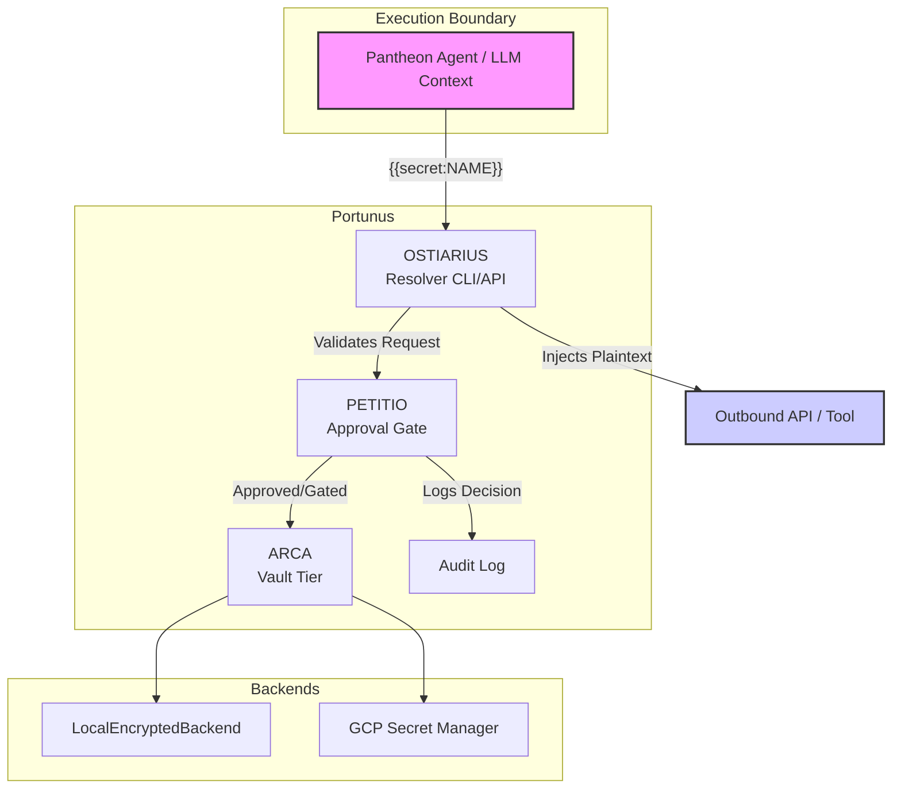

# Architecture

Portunus is the secret broker system for the Pantheon ecosystem. It ensures that agents and language models never see plaintext secrets in their contexts. Instead, they reference secrets by name (e.g., `{{secret:slack-bot-token}}`), and Portunus resolves these at the execution boundary.

## Component Flow

## Role in Pantheon
Portunus is the fundamental security component of the Dostal harness. It ensures that API keys, database credentials, and session states are securely managed, audited, and never leaked to an agent's context.

### Toggle & A/B Metrics
*(Standard OSS Note: Portunus currently relies on fixed configuration for its backends. A/B testing of backend performance or gating policies is on the roadmap but not yet implemented.)*
